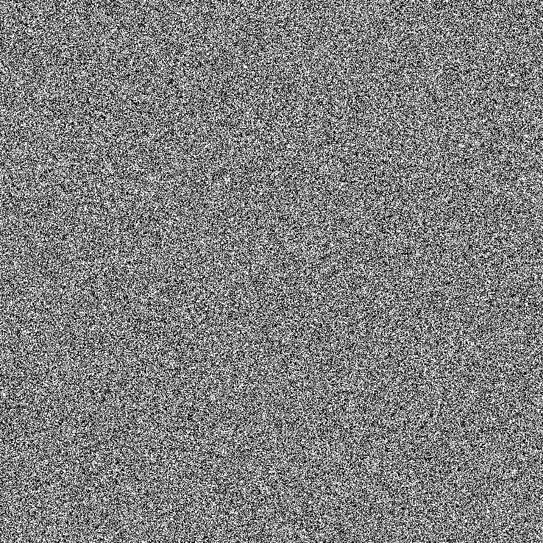

# hash-visualizer

little toy project of mine i wrote to visualize the randomness of hash functions, currently setup with fnv1/fnv1a, but you can tweak it to whatever you want!

Usage:

`bin file|string <filepath|inputtext>`

Example:

